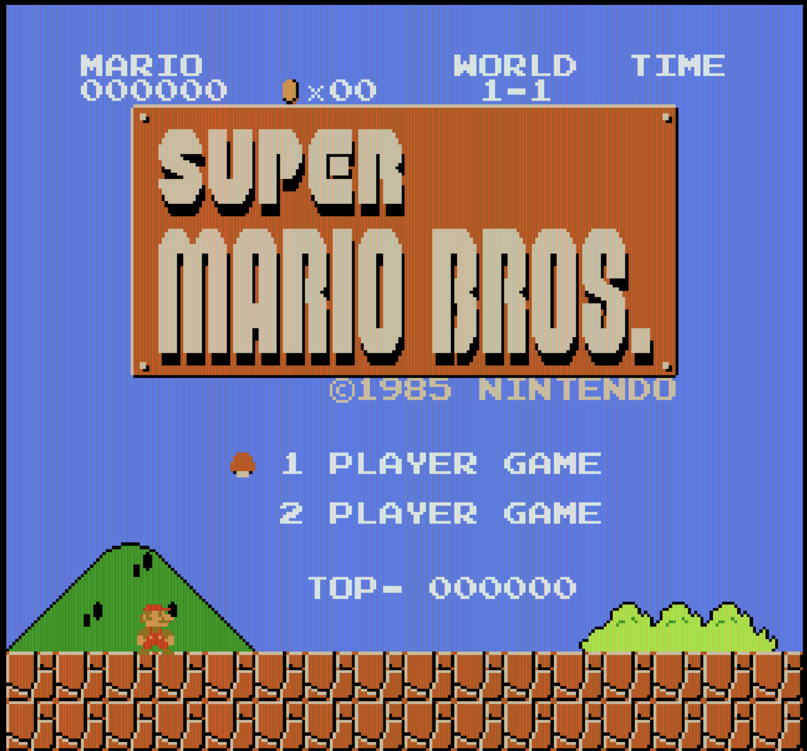
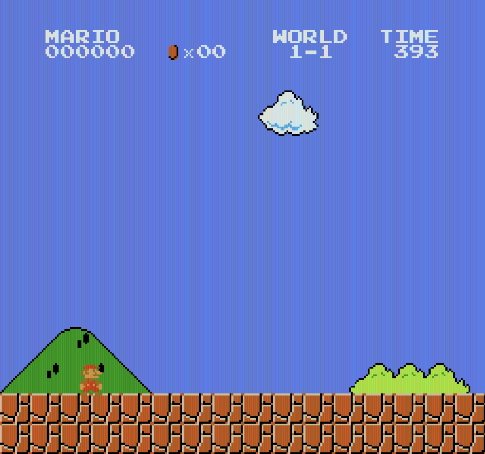

<div align="center"><h1>&nbsp;LocalGenie - Personal Computer Use Agent</h1></div>

<p align="center">
<a href="https://x.com/largemodelgame"><b>Demos on X</b></a>
</p>

## Contents
- [Introduction](#introduction)
- [Installation](#installation)
- [APIs](#apis)
- [Games](#games)
  - Super Mario Bros 1983

## Introduction

The goal of is project is to build user-friendly computer use agents (CUAs) that can run on your PC and laptops. As part of LMGames, our current focus is on building local gaming agents.

Current features:

- Gaming agents for Platformer and Atari games.

## Installation

1. Clone this repository:
```
git clone https://github.com/lmgame-org/LocalGenie.git
cd LocalGenie
```
2. Install dependency:
```
conda create -n local_cua python==3.9 -y
pip install -r requirements.txt
```

## APIs

Currently we support gaming agents based on the following models:

- OpenAI:
  - gpt-4o
  - gpt-4o-mini
  - o1
- Anthropic:
  - claude-3-5-sonnet-20241022
  - claude-3-7-sonnet-20250219
- Gemini:
  - gemini-1.5-pro

Set your API keys with:

```
export OPENAI_API_KEY={YOUR_OPENAI_API_KEY}
export ANTHROPIC_API_KEY={YOUR_ANTHROPIC_API_KEY}
export GEMINI_API_KEY={your_GEMINI_API_KEY}
```

## Games

### Super Mario Bros

#### Game Installation

Install your Super Mario Bros game. In our demo, we adopt [SuperMarioBros-C](https://github.com/MitchellSternke/SuperMarioBros-C).

Navigate to the repo and follow the installation instructions.

#### Prepare to launch the game

1. Once the game is built, launch the game with
```
cd $YOUR_WORKPLACE/SuperMarioBros-C/build
./smbc
```

2. Full screen the game by pressing `F`. You should be able to see:

<p align="center">

</p>

3. Open another screen, launch your agent in terminal with
```
cd $YOUR_WORKPLACE/LocalGenie
python games/superMario/mario_agent.py --api_provider {your_favorite_api_provider} --model_name {official_model_codename}
```

4. Due to concurrency issue, sometimes the agent will temporarily pause your game by pressing `Enter`. To avoid the issue, you can launch the agent only after entering the game upon seeing:

<p align="center">

</p>

#### Other command options
```
--concurrency_interval: Interval in seconds between starting workers.

--api_response_latency_estimate: Estimated API response latency in seconds.

--policy: 'long', or 'short'. In 'long' or 'short' modes only those workers are enabled.
```

#### Build your own policy

You can implement your own policy in `mario_agent.py`! Deploying high-concurrency strategy with short-term planning streaming workers vs. low-concurrency strategy with long-term planning workers, or a mix of both. Try and find out which one works better!
