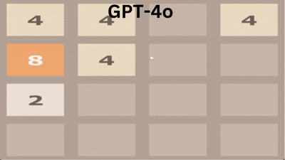
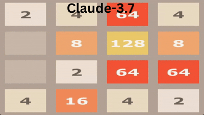
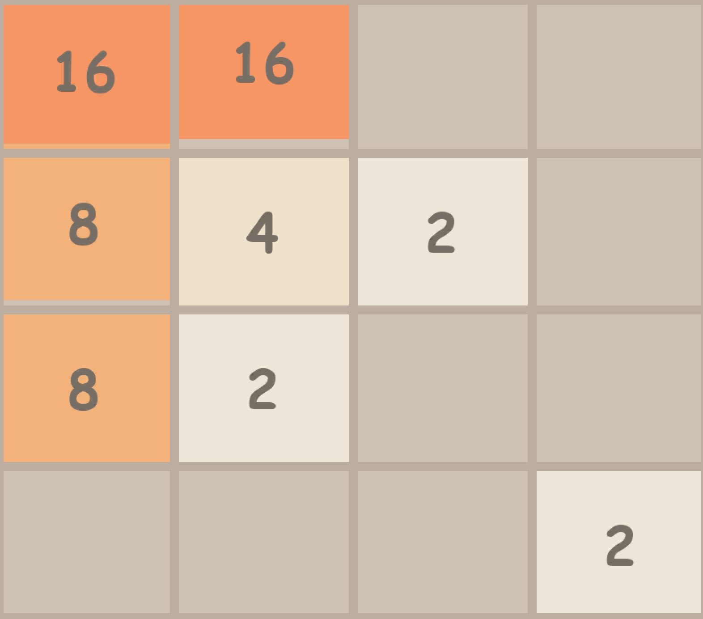
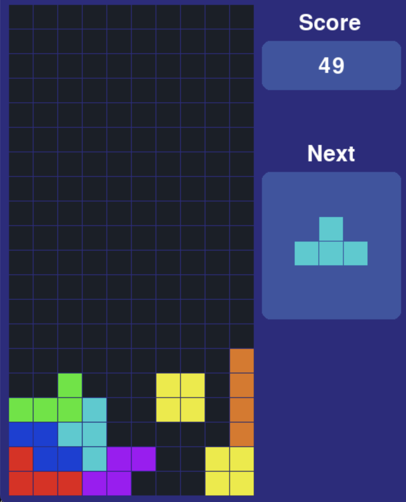

<div align="center"><h1>&nbsp;GamingAgent - Personal Computer Gaming Agent</h1></div>

<p align="center">
<a href="https://x.com/largemodelgame"><b>Demos on X</b></a>
</p>

## Contents
- [Gallery](#gallery)
- [Introduction](#introduction)
- [Installation](#installation)
- [APIs](#apis)
- [Games](#games)
  - [Super Mario Bros 1985](#super-mario-bros-1985-by-nintendo)
  - [2048](#2048)
  - [Tetris](#tetris)

## Gallery

### 2048 AI Gameplay Comparison

🎥 Here you can see our AI gaming agents in action, demonstrating their gameplay strategies across different games!

<div align="center">
  <table>
    <tr>
      <td align="center"><b>GPT-4o Gameplay</b></td>
      <td align="center"><b>Claude-3.7 Gameplay</b></td>
    </tr>
    <tr>
      <td>
        
      </td>
      <td>
        
      </td>
    </tr>
  </table>
</div>


## Introduction

The goal of this repo is to provide an easy solution of deploying computer use agents (CUAs) that run on your PC and laptops. As part of LMGames, our current focus is on building local gaming agents.

Current features:

- Gaming agents for Platformer and Atari games.

## Installation

1. Clone this repository:
```
git clone https://github.com/lmgame-org/LocalGenie.git
cd LocalGenie
```
2. Install dependency:
```
conda create -n game_cua python==3.10 -y
pip install -r requirements.txt
```

## APIs

Currently we support gaming agents based on the following models:

- OpenAI:
  - gpt-4o
  - gpt-4o-mini
  - o1
- Anthropic:
  - claude-3-5-sonnet-20241022
  - claude-3-7-sonnet-20250219
- Gemini:
  - gemini-1.5-pro

Set your API keys with:

```
export OPENAI_API_KEY={YOUR_OPENAI_API_KEY}
export ANTHROPIC_API_KEY={YOUR_ANTHROPIC_API_KEY}
export GEMINI_API_KEY={your_GEMINI_API_KEY}
```

⚠️ Due to concurrency, deploying the agent with high-end models (and a large number of workers) could incur higher cost.

## Games

### Super Mario Bros (1985 by Nintendo)

#### Game Installation

Install your Super Mario Bros game. In our demo, we adopt [SuperMarioBros-C](https://github.com/MitchellSternke/SuperMarioBros-C).

Navigate to the repo and follow the installation instructions.

#### Launch Gaming Agent

1. Once the game is built, download and move the ROM file:
```
mv path-to-your-ROM-file/"Super Mario Bros. (JU) (PRG0) [!].nes" $YOUR_WORKPLACE/SuperMarioBros-C/build/
```

2. Launch the game with
```
cd $YOUR_WORKPLACE/SuperMarioBros-C/build
./smbc
```

3. Full screen the game by pressing `F`. You should be able to see:

<p align="center">

</p>

4. Open another screen, launch your agent in terminal with
```
cd $YOUR_WORKPLACE/GamingAgent
python games/superMario/mario_agent.py --api_provider {your_favorite_api_provider} --model_name {official_model_codename}
```

5. Due to concurrency issue, sometimes the agent will temporarily pause your game by pressing `Enter`. To avoid the issue, you can launch the agent only after entering the game upon seeing:

<p align="center">

</p>

#### Other command options
```
--concurrency_interval: Interval in seconds between starting workers.

--api_response_latency_estimate: Estimated API response latency in seconds.

--policy: 'long', 'short', 'alternate' or 'mixed'. In 'long' or 'short' modes only those workers are enabled.
```

#### Build your own policy


You can implement your own policy in `mario_agent.py`! Deploying high-concurrency strategy with short-term planning streaming workers vs. low-concurrency strategy with long-term planning workers, or a mix of both.

In our early experiments, 'alternate' policy performs well. Try it yourself and find out which one works better!

### 2048

2048 is a sliding tile puzzle game where players merge numbered tiles to reach the highest possible value. In our demo, we adopt and modify [2048-Pygame](https://github.com/rajitbanerjee/2048-pygame) 

#### Game Set Up

Run the 2048 game with a defined window size:
```sh
python games/game_2048/game_logic.py -wd 600 -ht 600
```
<p align="center">

</p>

Use **Ctrl** to restart the game and the **arrow keys** to move tiles strategically.

Start the AI agent to play automatically:

```sh
python games/game_2048/2048_agent.py
```


#### Other command options
```
--api_provider: API provider to use.

--model_name: Model name (has to come with vision capability).

```


### Tetris

#### Game Installation

Install your Tetris game. In our demo, we adopt [Python-Tetris-Game-Pygame](https://github.com/rajatdiptabiswas/tetris-pygame).

#### Launch Gaming Agent

1. Launch the game with
```
cd $YOUR_WORKPLACE/Python-Tetris-Game-Pygame
python main.py
```

⚠️ In your Tetris implementation, Modify game speed to accomodate for AI gaming agent latency. For example, in the provided implementation, navigate to `main.py`, line 23: change event time to 500~600ms.

You should be able to see:

<p align="center">

</p>

2. Adjust Agent's Field of Vision. Either full screen your game or adjust screen region in `/games/tetris/workers.py`, line 67 to capture only the gameplay window. For example, in `Python-Tetris-Game-Pygame` with MacBook Pro, change the line to `region = (0, 0, screen_width // 32 * 9, screen_height // 32 * 20)`.

3. Open another screen, launch your agent in terminal with
```
cd $YOUR_WORKPLACE/GamingAgent
python games/tetris/tetris_agent.py
```

#### Other command options
```
--api_provider: API provider to use.

--model_name: Model name (has to come with vision capability).

--concurrency_interval: Interval in seconds between consecutive workers.

--api_response_latency_estimate: Estimated API response latency in seconds.

--policy: 'fixed', only one policy is supported for now.
```

#### Build your own policy

Currently we find single-work agent is able to make meaningful progress in the game. If the gaming agent spawns independent workers, they don't coordinate well. We will work on improving the agent and gaming policies. We also welcome your thought and contributions.
